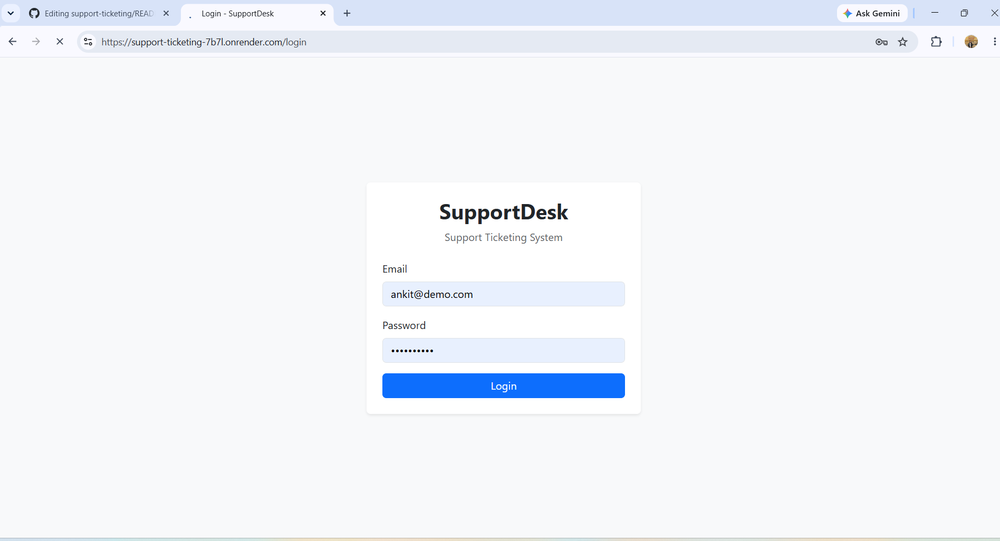
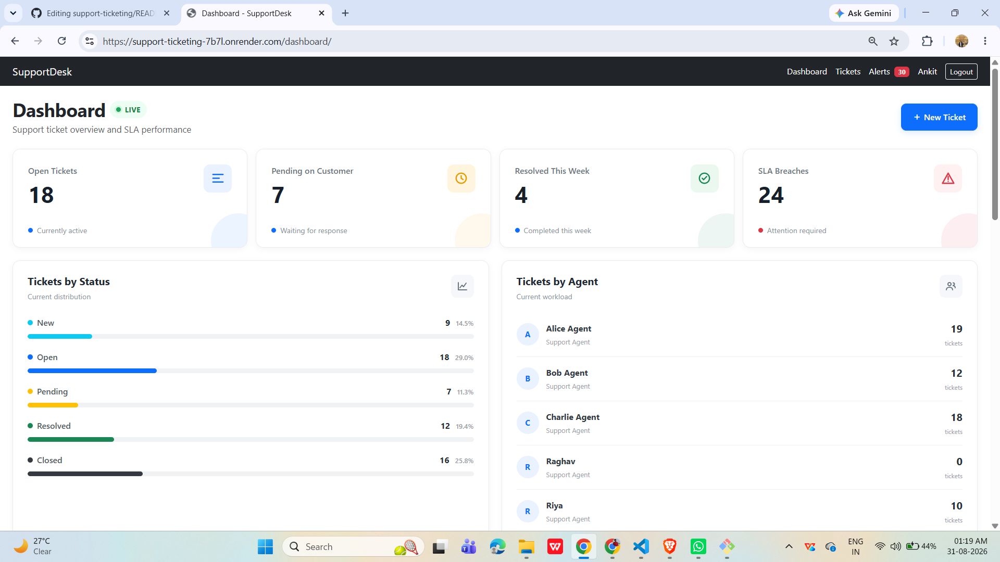
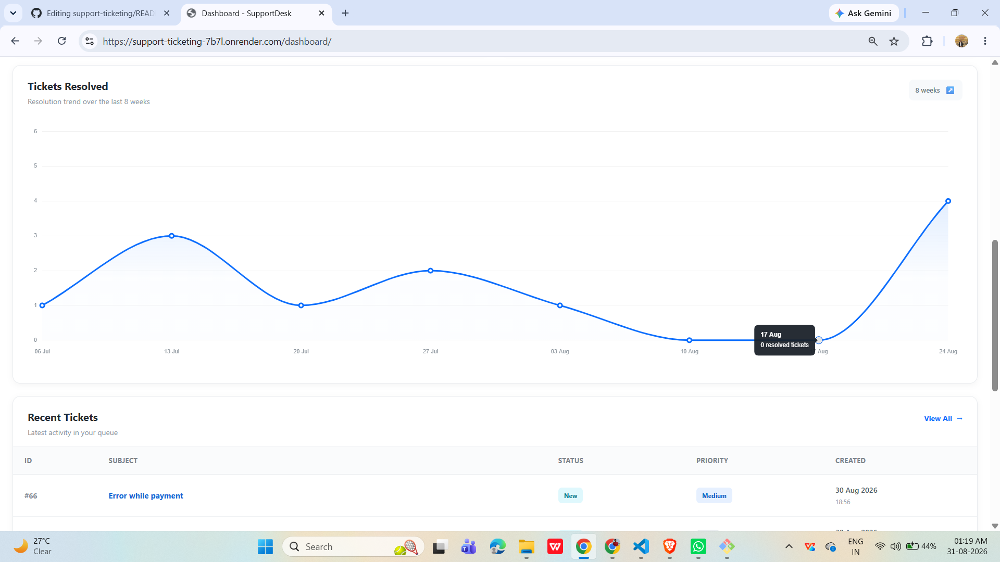
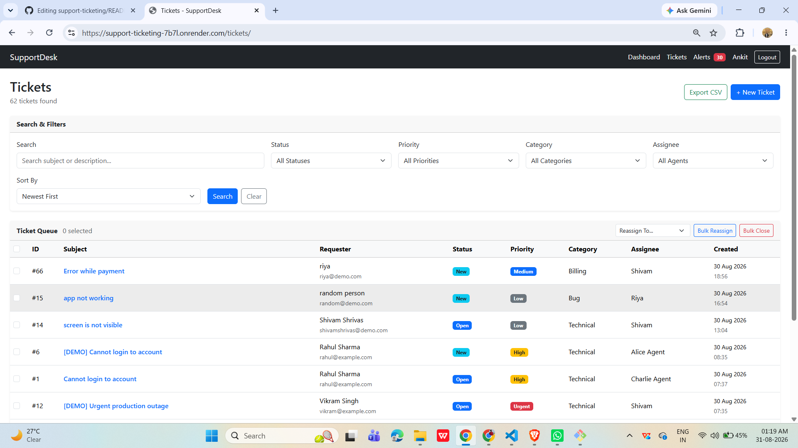
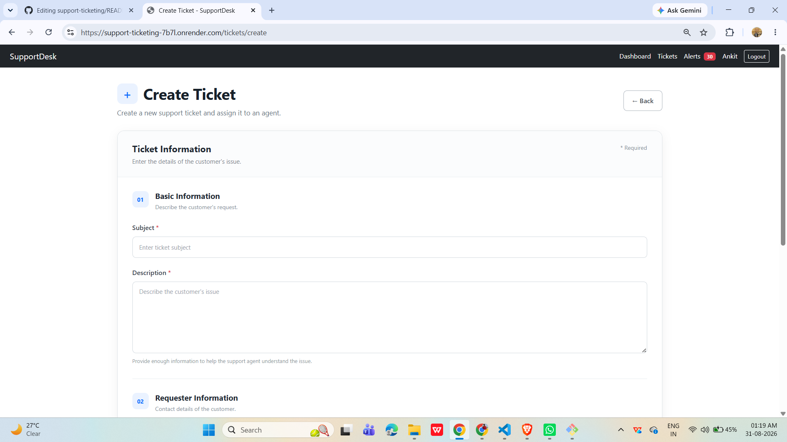
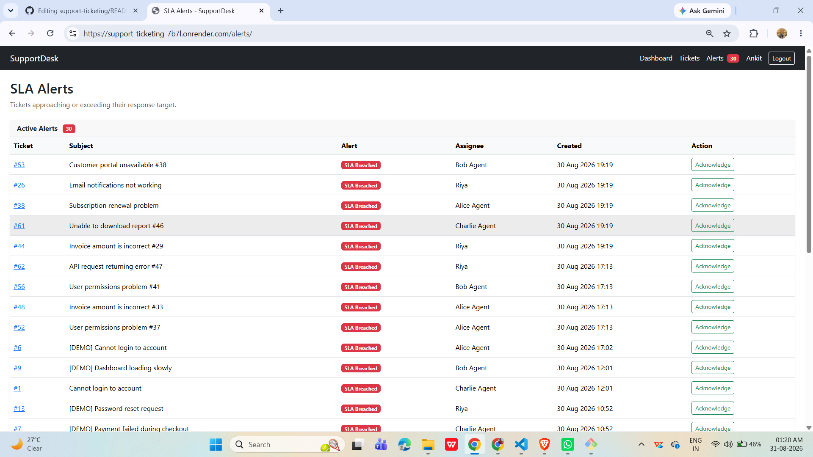

# SupportDesk

SupportDesk is a web-based support ticketing system built with Flask and PostgreSQL.

It allows support teams to create, manage, assign, track and resolve customer support tickets. It also includes role-based access, ticket history, collaborators, bulk actions, dashboards and SLA alerts.

## Live Application

https://support-ticketing-7b7l.onrender.com/login

## GitHub Repository

https://github.com/ankit7828/support-ticketing

## Demo Credentials

| Role | Email | Password |
|---|---|---|
| Supervisor | ankit@demo.com | Ankit@7828 |
| Agent | shivam@demo.com | shivam@123 |

## Basic Workflow

1. Login as a Supervisor or Agent.

3. Create or open a support ticket.
4. Assign the ticket to an agent.
5. Add replies or internal notes.
6. Change the ticket status as the issue progresses.
7. Add collaborators when multiple agents are needed.
8. Monitor SLA alerts from the Alerts page.
9. Use the Dashboard to monitor ticket activity and SLA performance.

---

# Features

### 1. User Authentication

- Login and logout functionality
- Secure password hashing
- Role-based access
- Agent and Supervisor roles

### 2. Ticket Management

- Create new tickets
- View ticket details
- Edit tickets
- Assign tickets to agents
- Reassign tickets
- Change ticket status
- Archive and restore tickets
- Add replies and internal notes

### 3. Ticket Status

Tickets can move through different stages:

- New
- Open
- Pending
- Resolved
- Closed

### 4. Priority and Categories

Tickets support different priorities:

- Low
- Medium
- High
- Urgent

Tickets can also be organized using categories such as:

- Technical
- Billing
- Account
- Other categories configured in the application

### 5. Search and Filters

The ticket list supports:

- Search by subject or description
- Filter by status
- Filter by priority
- Filter by category
- Filter by assignee
- Sort tickets

### 6. Bulk Actions

Multiple tickets can be selected and managed together.

Available bulk operations include:

- Bulk reassignment
- Bulk closing

This makes it easier for supervisors to manage a large number of tickets.

### 7. Collaborators

A ticket can have multiple agents working on it.

The primary assignee is responsible for the ticket, while collaborators can also work on the same ticket when additional support is required.

### 8. Ticket History

The system keeps a record of important ticket changes.

This includes events such as:

- Ticket creation
- Status changes
- Assignment changes
- Replies
- Other ticket updates

A separate status history also records the previous and new status.

### 9. SLA Alerts

The application tracks the response SLA for tickets.

It can show:

- Tickets approaching their SLA target
- SLA breached tickets
- SLA alert creation
- Alert acknowledgement

Agents can acknowledge alerts for tickets they are allowed to work on.

### 10. Dashboard

The dashboard provides an overview of the support system.

It shows:

- Open tickets
- Pending tickets
- Tickets resolved this week
- SLA breaches
- Tickets by status
- Tickets by agent
- Weekly resolved ticket chart
- Recent tickets

---

# Technology Stack

| Layer | Technology |
|---|---|
| Frontend | HTML, CSS, Bootstrap, JavaScript |
| Charts | Chart.js |
| Backend | Python, Flask |
| Authentication | Flask-Login |
| ORM | Flask-SQLAlchemy |
| Database Migration | Flask-Migrate / Alembic |
| Database | PostgreSQL |
| Database Driver | psycopg2 |
| Server | Gunicorn |
| Hosting | Render |
| Version Control | Git and GitHub |

---

# Images about project

## Screenshots

### 1. Login Page

The login page provides secure access to the SupportDesk application for agents and supervisors.



---

### 2. Dashboard

The dashboard provides an overview of ticket status, agent workload, resolved tickets, and SLA breaches.



---

### 3. Ticket Resolution Chart

The dashboard includes a resolution trend chart showing the number of tickets resolved over the last 8 weeks.



---

### 4. Ticket Management

The ticket management page allows users to search, filter, sort, assign, reassign, close, and export tickets.



---

### 5. Create Ticket

The Create Ticket page allows support staff to enter ticket details, requester information, priority, category, and assignment.



---

### 6. SLA Alerts

The SLA Alerts page shows tickets that are approaching or have exceeded their SLA response target. Agents can acknowledge alerts from this page.



# Project Structure Used

```text
support-ticketing/
│
├── app/
│   ├── models/
│   ├── routes/
│   ├── services/
│   ├── static/
│   ├── templates/
│   ├── extensions.py
│   ├── config.py
│   └── __init__.py
│
├── docs/
│   ├── architecture.md
│   ├── decisions.md
│   ├── plan.md
│   ├── schema.md
│   └── ai-prompts.md
│
├── migrations/
│
├── tests/
│
├── .env.example
├── .gitignore
├── README.md
├── requirements.txt
├── run.py
├── wsgi.py
├── seed.py
└── seed_50.py  
